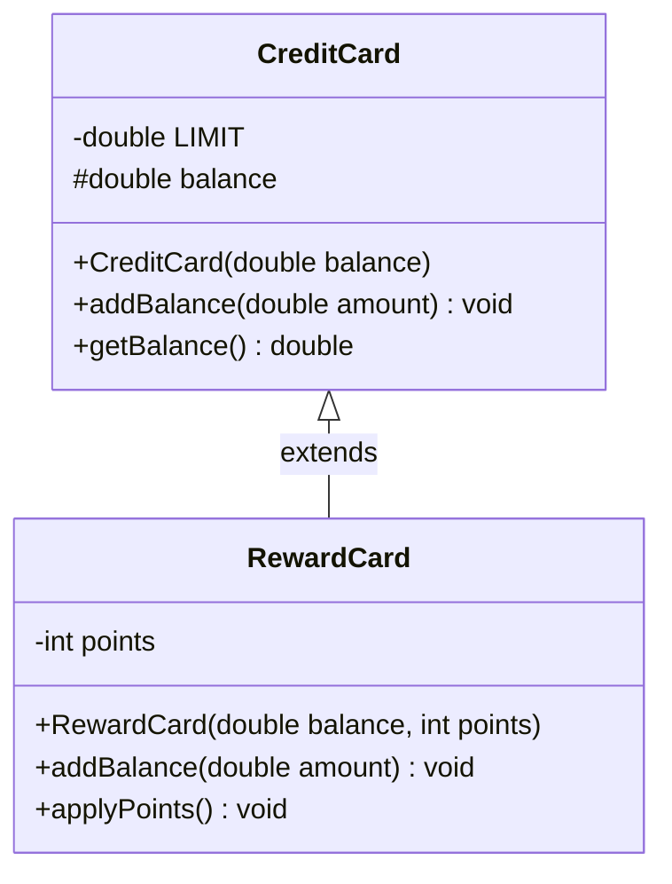
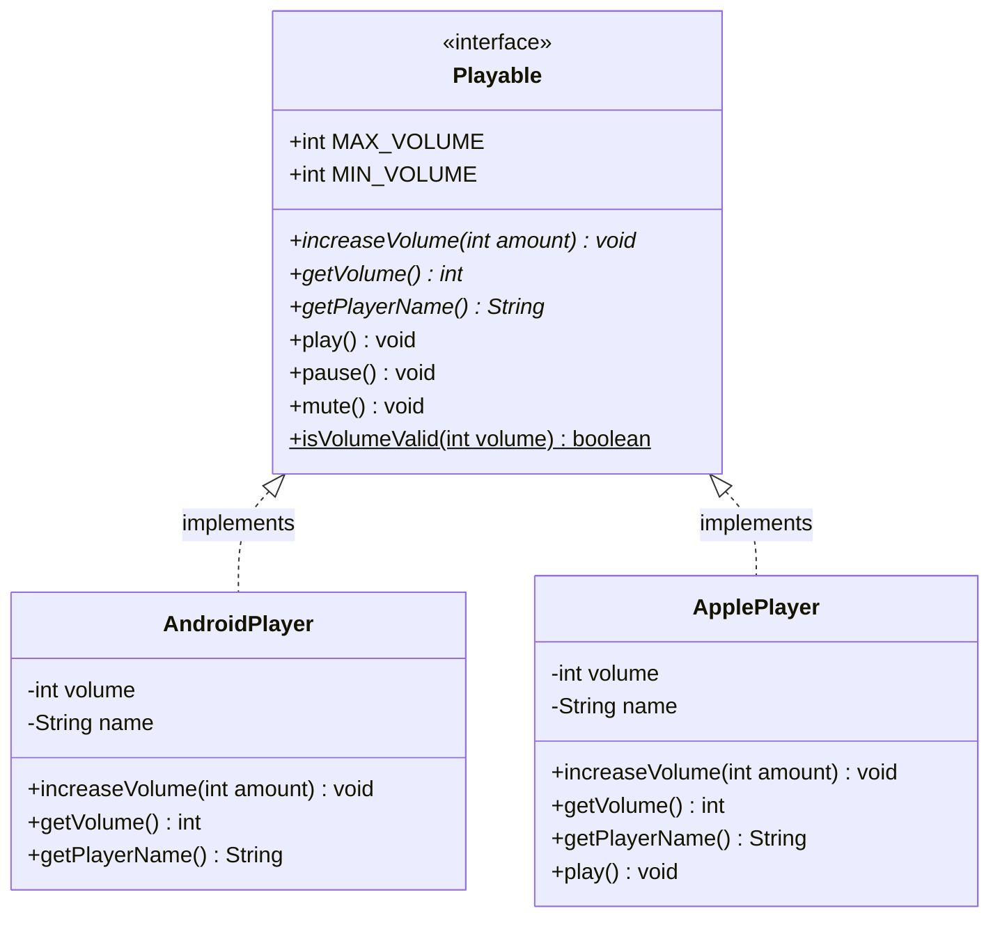
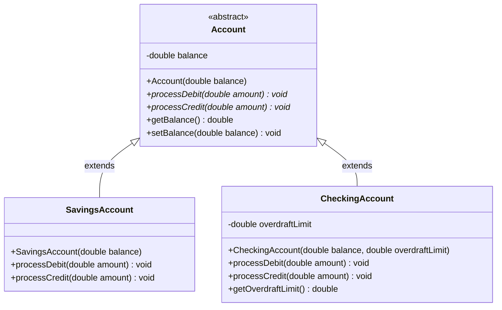

# Interfaces and Abstract Classes — Demo Overview

This project demonstrates three core OOP concepts in Java: **Inheritance**, **Interfaces**, and **Abstract Classes**.

---

## 1. Inheritance

A child class **extends** a parent class to reuse fields and methods. The child can **override** methods to change behavior.



| Keyword      | Purpose                                          |
| ------------ | ------------------------------------------------ |
| `extends`    | Inherit from a parent class                      |
| `super(...)` | Call the parent's constructor                     |
| `@Override`  | Mark a method as overriding the parent's version  |
| `protected`  | Visible to same package + subclasses              |

**Polymorphism:** Same method call (`addBalance`), different behavior depending on the actual object type. A `CreditCard[]` can hold both `CreditCard` and `RewardCard` objects.

---

## 2. Interfaces

An interface defines a **contract** — a set of methods any implementing class must provide. Unrelated classes can share the same interface.



| What                  | Detail                                                     |
| --------------------- | ---------------------------------------------------------- |
| Abstract methods      | No body — every implementing class MUST provide one        |
| Default methods       | Have a body — implementing classes inherit and MAY override |
| Static methods        | Belong to the interface itself, called as `Playable.xxx()` |
| Constants             | `public static final` — the only "fields" allowed          |
| Cannot instantiate    | `new Playable()` is a compile error                        |
| Multiple interfaces   | A class can `implements A, B, C`                           |

**Key point:** `AndroidPlayer` uses the default `play()` from `Playable`. `ApplePlayer` overrides it with its own version.

---

## 3. Abstract Classes

An abstract class sits between a regular class and an interface. It can have **instance fields** (state), **concrete methods** (shared code), and **abstract methods** (subclasses must implement).



- `SavingsAccount`: rejects debits exceeding the balance (no overdraft).
- `CheckingAccount`: allows overdraft up to a configurable limit.
- Both inherit `getBalance()` and `setBalance()` from `Account` without rewriting them.

---

## Interface vs Abstract Class — When to Use Each

| Feature             | Interface              | Abstract Class          |
| ------------------- | ---------------------- | ----------------------- |
| Fields (state)      | Constants only         | Instance fields (state) |
| Constructors        | No                     | Yes                     |
| Multiple            | `implements` many      | `extends` only ONE      |
| Method bodies       | `default` / `static`   | Abstract + concrete     |
| Use when            | Shared **CAPABILITY**  | Shared **STATE** + behavior |

> **Rule of thumb:** "Can do" = interface. "Is a (with shared data)" = abstract class.

---

## Files in This Project

```
src/main/java/com/ironhack/interfaces/
├── CreditCard.java          ← Inheritance parent
├── RewardCard.java           ← extends CreditCard
├── InheritanceDemo.java      ← Demo: extends, super(), @Override, polymorphism
│
├── Playable.java             ← Interface (constants, abstract, default, static)
├── AndroidPlayer.java        ← implements Playable (uses defaults)
├── ApplePlayer.java          ← implements Playable (overrides play())
├── InterfaceDemo.java        ← Demo: all interface features
│
├── Account.java              ← Abstract class (shared state + abstract methods)
├── SavingsAccount.java       ← extends Account (no overdraft)
├── CheckingAccount.java      ← extends Account (overdraft allowed)
├── AbstractClassDemo.java    ← Demo: abstract class + polymorphism
│
└── Main.java                 ← Runs all three demos
```
