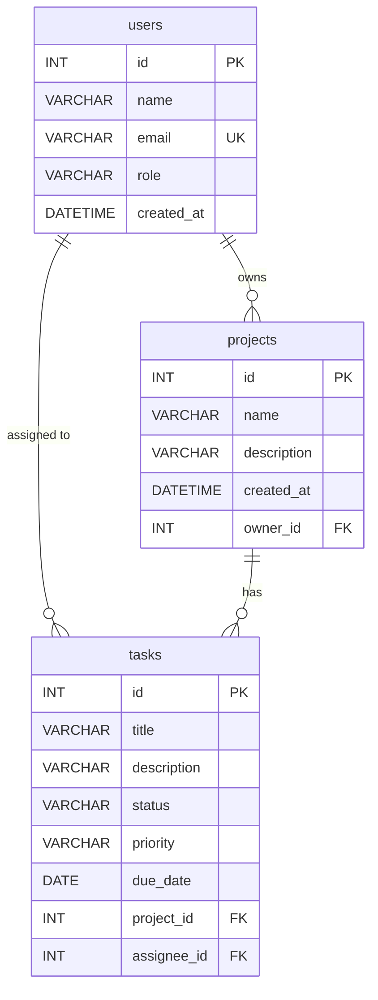

# Day 1: Database Fundamentals

---

### What is a Relational Database?

A relational database organizes data into **tables** (like spreadsheets). Each table has:

- **Columns** (fields): define what data is stored
- **Rows** (records): individual entries

```
projects table
+----+-----------+---------------------------+---------------------+
| id | name      | description               | created_at          |
+----+-----------+---------------------------+---------------------+
|  1 | IronBoard | Project management app    | 2026-01-15 10:30:00 |
|  2 | IronSchool| Learning platform         | 2026-01-20 09:00:00 |
+----+-----------+---------------------------+---------------------+
```

**Why databases instead of HashMaps?**

1. **Persistence** -- data survives restarts
2. **Constraints** -- rules that prevent invalid data
3. **Relationships** -- tables link to each other
4. **Querying** -- find exactly what you need with SQL

---

### Entity-Relationship (ER) Diagram

An ER diagram is a visual map of your database. Each box is a table, each line is a relationship.

**IronBoard Schema:**



---

### ID Strategies

| Strategy       | Type             | Pros                           | Cons                             | Use When                         |
| -------------- | ---------------- | ------------------------------ | -------------------------------- | -------------------------------- |
| AUTO_INCREMENT | `INT` / `BIGINT` | Simple, sequential, fast       | Predictable, single-server only  | Default for most apps            |
| UUID           | `CHAR(36)`       | Globally unique, not guessable | Larger, slower index, unreadable | Public APIs, distributed systems |

---

## Topics Covered in Scripts

### 01: Database Creation & Navigation

- `CREATE DATABASE`, `USE`, `SHOW DATABASES`, `SHOW TABLES`
- DDL vs DML distinction
- `IF NOT EXISTS` pattern for idempotent scripts
- Character sets (`utf8mb4`)

### 02: CREATE TABLE with Constraints

- `PRIMARY KEY` with `AUTO_INCREMENT`
- `NOT NULL`, `UNIQUE`, `DEFAULT`
- `FOREIGN KEY` with named `CONSTRAINT`
- ID strategies: AUTO_INCREMENT vs UUID
- Data types: `ENUM`, `DECIMAL`, `BOOLEAN`, `CHECK`
- Common MySQL error codes and how to debug them

### 03: ALTER TABLE & DROP TABLE

- `ADD COLUMN`, `MODIFY COLUMN`, `DROP COLUMN`
- `RENAME TABLE`
- Adding `FOREIGN KEY` and `CHECK` constraints to existing tables
- `DROP TABLE` with correct order (child before parent)

---

### Common MySQL Errors (Know Your Error Codes)

When something goes wrong, MySQL returns an error code. Knowing these codes saves debugging time.

| Code | Meaning | Fix |
|------|---------|-----|
| **1005** | Can't create table. If the message includes **errno 150**, the foreign key is incorrectly formed | Check the full error text; for FK issues, match referenced/referencing column type/size/sign, ensure parent table exists, and referenced column is indexed |
| **1007** | Can't create database; database exists | Use `IF NOT EXISTS` |
| **1046** | No database selected | Run `USE database_name` first |
| **1050** | Table already exists | Use `CREATE TABLE IF NOT EXISTS` or `DROP TABLE` first |
| **1054** | Unknown column in field list | Check column name; use `DESCRIBE table_name` |
| **1062** | Duplicate entry for key (UNIQUE violation) | Use a different value or `UPDATE` the existing row |
| **1064** | Syntax error in SQL | Check for typos, missing commas, unmatched quotes |
| **1091** | Can't drop the requested column/key/index; it doesn't exist | Confirm the exact object name before dropping it |
| **1146** | Table doesn't exist | Check spelling; run `SHOW TABLES` |
| **1215** | Cannot add foreign key constraint | Referenced column must match type/size/sign and be PK or UNIQUE; parent table must exist |
| **1364** | Field doesn't have a default value | Include the field in `INSERT` or add a `DEFAULT` |
| **1451** | Cannot delete or update a parent row (FK prevents it) | Delete/update child rows first, or use `ON DELETE CASCADE` / `ON UPDATE CASCADE` where appropriate |
| **1452** | Cannot add or update a child row (FK reference doesn't exist) | Create the parent row first, or check the referenced ID |
| **3819** | Check constraint is violated | Fix the value or relax the `CHECK` constraint |
